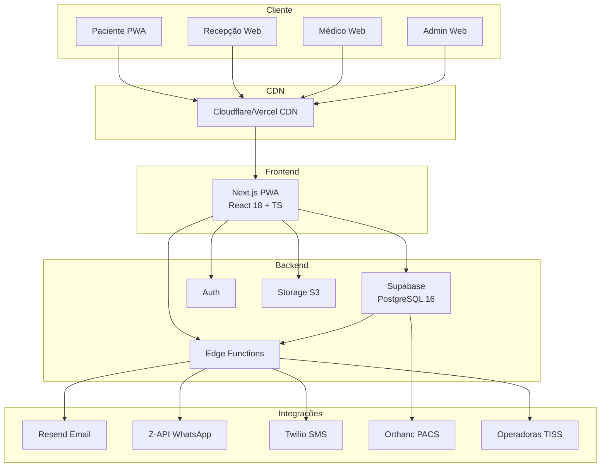
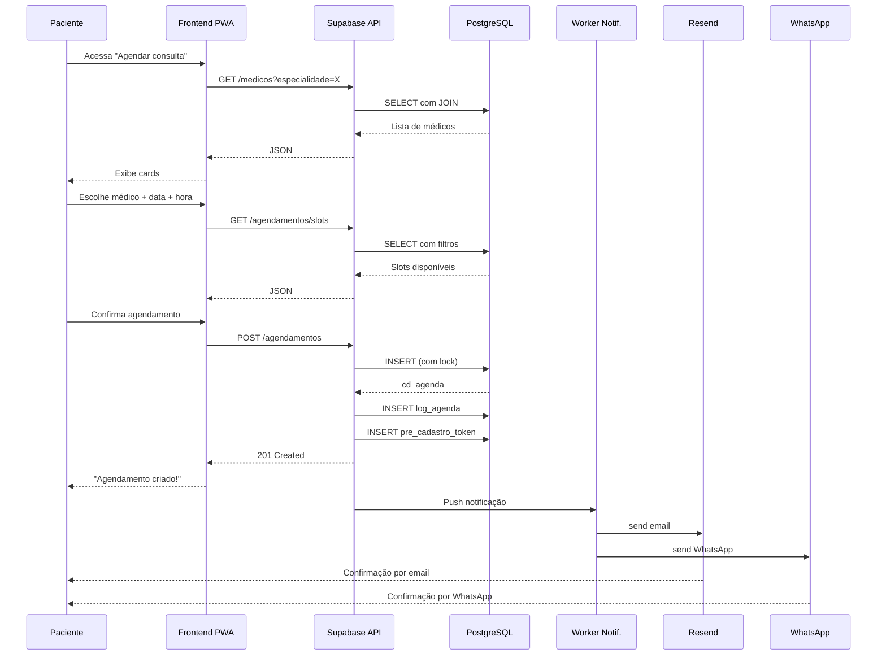
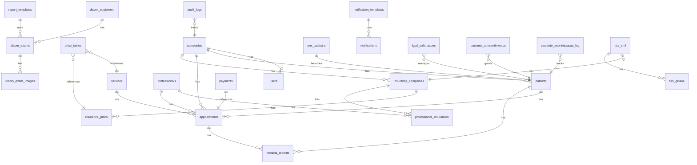
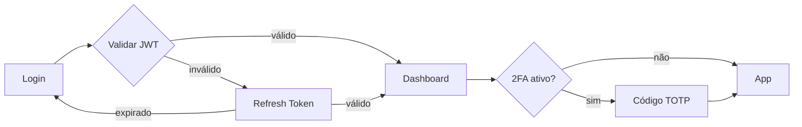
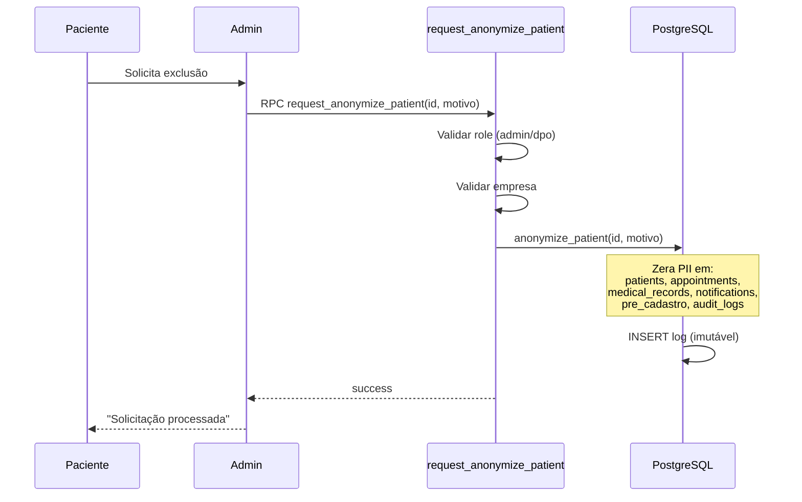

# Arquitetura — ProntoClinic Hub

## Visão geral

## Diagrama de sequência: Agendamento de consulta

## Diagrama ER do banco

## Fluxo de autenticação

## Fluxo LGPD: Direito ao esquecimento

## Camadas

### 1. Cliente (Frontend)

Aplicação React 18 + TypeScript servida como PWA instalável. Suporta três perfis principais:

- **Paciente (PWA)**: instala no celular, acessa marcação de consulta, exames, prontuário e LGPD.
- **Recepção (Web)**: gerencia agenda, cadastros, confirmações e financeiro do dia-a-dia.
- **Médico (Web)**: prontuário eletrônico, prescrição, laudos e DICOM viewer.
- **Admin (Web)**: configurações, usuários, relatórios, BI e LGPD.

Build via Vite. Code-splitting por rota com `React.lazy()`. Bundle final dividido em chunks manuais (react, supabase, ui, chart, etc).

### 2. CDN / Edge

Cloudflare ou Vercel CDN na frente do app estático. Faz cache de assets, HTTPS com HSTS, headers de segurança (CSP, X-Frame-Options, Referrer-Policy) e compressão Brotli.

### 3. Backend (Supabase)

- **PostgreSQL 16**: banco relacional com RLS (Row Level Security) por empresa (`company_id`).
- **Edge Functions (Deno)**: funções server-side para lógica pesada (TISS XML, DICOM proxy, relatórios).
- **Auth**: Supabase Auth (JWT + Refresh Token) com suporte a 2FA (TOTP) para admin/DPO.
- **Storage S3**: bucket para anexos de prontuário, PDFs de laudos e imagens DICOM processadas.

### 4. Integrações externas

- **Resend**: envio de e-mails transacionais (confirmação de agendamento, recuperação de senha, exportação LGPD).
- **Z-API**: WhatsApp Business API para confirmação 24h antes e lembretes.
- **Twilio**: SMS fallback quando WhatsApp falha.
- **Orthanc (PACS)**: armazenamento e recuperação de imagens DICOM (RX, TC, RM, US).
- **Operadoras TISS**: comunicação XML ANS para faturamento de convênios.

### 5. Workers assíncronos

Worker Node.js rodando via PM2 consome filas internas e dispara notificações multicanal com retry exponencial.

### 6. Segurança em camadas

- **CSP strict** + headers no `index.html`.
- **DOMPurify** em qualquer HTML renderizado.
- **Zod** para validar toda entrada de formulário e env vars.
- **RLS no PostgreSQL** garantindo isolamento multi-tenant.
- **Bcrypt** para senhas (Supabase Auth).
- **Refresh token rotation** para sessões.
- **Auditoria imutável** (append-only com hash chain).

### 7. Observabilidade

- **Sentry**: erros frontend e backend.
- **UptimeRobot**: monitor de uptime HTTP.
- **Logs centralizados** em volume persistente (Docker/VPS) ou serviço gerenciado.
- **Migrations versionadas** em `supabase/migrations/`.

### 8. Multi-tenant

Cada tabela com dados de paciente tem coluna `company_id`. RLS policies usam `auth.uid()` → `users.company_id` para garantir isolamento. Helper `get_my_company_id()` (`SECURITY DEFINER` + `search_path` fixo) é usado dentro de policies e funções.

## Padrões e princípios

- **Offline-first no PWA**: service worker com cache de assets críticos.
- **Acessibilidade WCAG AA**: skip links, ARIA, navegação por teclado, axe-core em dev.
- **Internacionalização (i18n)**: pt-BR padrão, estrutura preparada para en/es.
- **Testes**: 69 specs E2E (Playwright) + 47 unitários (Vitest). Coverage mínimo 70% linhas / 60% branches.
- **CI/CD**: GitHub Actions rodando lint, typecheck, testes unit + E2E em Supabase local (Docker).