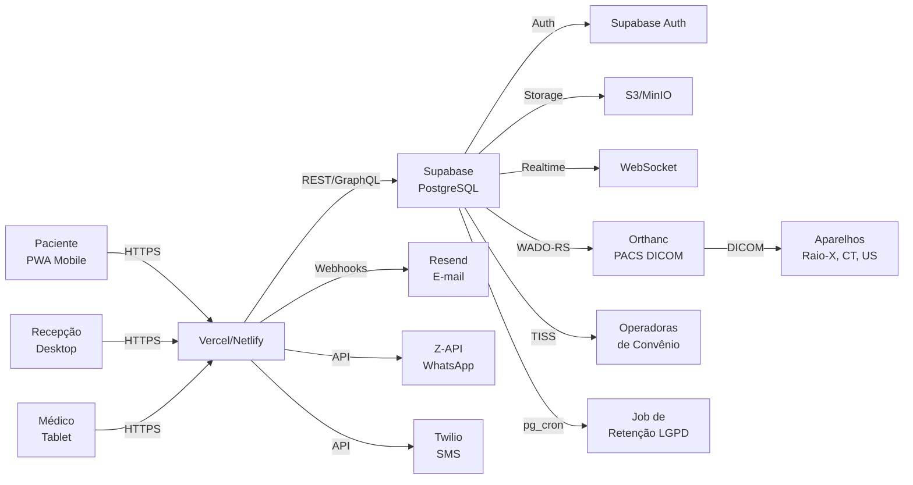

# ProntoMedic

> Sistema de gestão para clínicas e consultórios médicos. Agende, confirme e gerencie consultas online.

[](https://github.com)
[](LICENSE)
[](CHANGELOG.md)
[](e2e/)
[](vitest.config.ts)
[](SECURITY.md)
[](LGPD.md)
[](tsconfig.json)
[](supabase/migrations/)

## ✨ Funcionalidades

### Para Recepção
- Agenda multi-profissional com drag-and-drop
- Cadastro completo de pacientes (LGPD compliant)
- Pré-cadastro online (paciente se cadastra de casa)
- Confirmação de presença via SMS/WhatsApp/e-mail
- Check-in com totem (opcional)
- Fila de atendimento com painel

### Para Profissionais de Saúde
- Prontuário eletrônico estruturado
- Prescrição digital com assinatura ICP-Brasil
- Solicitação de exames integrada
- Templates de laudo
- Visualizador DICOM (raio-X, tomografia, etc)

### Para Faturamento
- TISS 3.05 (geração, envio, retorno)
- Glosa e recurso
- BPA / AIH (SUS)
- Comissionamento de profissionais
- Conciliação bancária

### Para Administração
- Multi-empresa e multi-unidade
- Convênios, planos, tabela de preços
- Credenciamento de profissionais
- LGPD: consentimento, anonimização, exportação, direito ao esquecimento
- Auditoria de acesso (CFM 1.821/2007)
- BI com KPIs de ocupação, no-show, glosa

### Para Paciente
- PWA instalável (celular)
- Pré-cadastro online
- Agendar, confirmar, cancelar, reagendar
- Ver exames / laudos
- Notificações por SMS/WhatsApp/e-mail
- Download de dados pessoais (LGPD)

## 🏗️ Stack

| Camada | Tecnologia |
|---|---|
| Frontend | React 18 + Vite + TypeScript + shadcn/ui |
| Backend | Supabase (PostgreSQL + Auth + Storage + Realtime) |
| Banco | PostgreSQL 16 (via Supabase) |
| PWA | vite-plugin-pwa + Service Worker |
| E-mail | Resend |
| SMS / WhatsApp | Twilio / Z-API |
| Telemedicina | Daily.co (planejado) |
| Pagamento | Stripe / PIX (planejado) |
| DICOM | Orthanc (PACS open source) |
| Deploy | Vercel / Netlify + Supabase Cloud |

## 🏗️ Arquitetura



## 📦 Pré-requisitos

- Node.js 20+
- npm 10+
- Conta Supabase (free tier OK para dev)
- Git
- (Opcional) Python 3.12 para scripts de migração

## 🚀 Quick Start

### 1. Clonar o repositório
```bash
git clone https://github.com/seu-usuario/prontoclinic-hub.git
cd prontoclinic-hub
npm install
```

### 2. Configurar variáveis de ambiente
```bash
cp .env.example .env
# Editar .env com suas credenciais do Supabase
```

### 3. Setup do Supabase
```bash
# Instalar Supabase CLI
brew install supabase/tap/supabase  # Mac
# ou
scoop install supabase  # Windows

# Login
supabase login

# Linkar com seu projeto
supabase link --project-ref SEU_REF

# Aplicar migrations
supabase db push

# Carregar seeds (opcional)
psql $DATABASE_URL -f supabase/seed_payment_sources.sql
psql $DATABASE_URL -f supabase/seed_insurances.sql
psql $DATABASE_URL -f supabase/seed_categories.sql
psql $DATABASE_URL -f supabase/seed_notification_templates.sql
```

### 4. Iniciar dev server
```bash
npm run dev
# Abrir http://localhost:5173
```

### 5. Testes
```bash
npm run test          # Vitest (unit)
npm run test:e2e      # Playwright (E2E)
npm run test:all      # Todos
```

### 6. Build de produção
```bash
npm run build
npm run preview
```

## 📁 Estrutura do projeto

```
prontoclinic-hub/
├── e2e/                          # Testes Playwright (E2E)
├── public/                       # Assets estáticos + ícones PWA
├── scripts/                      # Scripts utilitários (geração de ícones, etc.)
├── src/
│   ├── components/              # Componentes React reutilizáveis (shadcn/ui)
│   ├── config/                  # Configurações (env, feature flags)
│   ├── hooks/                   # Custom hooks
│   ├── lib/                     # Bibliotecas internas (supabase client, etc.)
│   ├── pages/                   # Páginas/rotas da aplicação
│   ├── services/                # Camada de serviço (APIs, integrações)
│   ├── test/                    # Setup de testes (Vitest)
│   ├── types/                   # Tipagens TypeScript
│   ├── utils/                   # Utilitários
│   ├── App.tsx                  # Componente raiz
│   ├── index.css                # Estilos globais
│   └── main.tsx                 # Bootstrap React
├── supabase/
│   └── migrations/              # 11 migrations SQL versionadas
├── .env.example                 # Template de variáveis de ambiente
├── components.json              # Configuração shadcn/ui
├── index.html                   # HTML raiz
├── package.json                 # Dependências e scripts
├── playwright.config.ts         # Configuração Playwright
├── tailwind.config.ts           # Configuração Tailwind
├── tsconfig.json                # Configuração TypeScript
└── vite.config.ts               # Configuração Vite + PWA
```

## 📚 Documentação adicional

- [MODULES.md](MODULES.md) — 24 módulos detalhados
- [MIGRATION.md](MIGRATION.md) — Migração do SIGH
- [LGPD.md](LGPD.md) — Conformidade LGPD
- [INTEGRATIONS.md](INTEGRATIONS.md) — Setup Orthanc, DICOM, TISS
- [INSTALL.md](INSTALL.md) — Instalação detalhada
- [CONTRIBUTING.md](CONTRIBUTING.md) — Como contribuir
- [MANUAL.md](MANUAL.md) — Manual do usuário
- [FAQ.md](FAQ.md) — Perguntas frequentes
- [SECURITY.md](SECURITY.md) — Política de segurança
- [CHANGELOG.md](CHANGELOG.md) — Histórico de versões
- [GO_LIVE_REAL_SIMULATION_REPORT.md](GO_LIVE_REAL_SIMULATION_REPORT.md) — Simulação de go-live
- [AUDIT_PROMPT.md](AUDIT_PROMPT.md) — Prompt de auditoria
- [LOVABLE_PROMPT.md](LOVABLE_PROMPT.md) — Prompt de geração

## 🔒 Segurança

Veja [SECURITY.md](SECURITY.md) para detalhes sobre política de segurança, versões suportadas e como reportar vulnerabilidades.

## 📄 Licença

Proprietário — todos os direitos reservados. Veja o arquivo de licença para detalhes.

## 💬 Suporte

- Issues: [GitHub Issues](https://github.com/seu-usuario/prontoclinic-hub/issues)
- Email: suporte@prontomedic.com.br
- Documentação: este repositório

## 🗺️ Roadmap

- [ ] v1.1 — Telemedicina (Daily.co)
- [ ] v1.2 — Pagamento online (Stripe + PIX)
- [ ] v1.3 — Mobile app (React Native)
- [ ] v2.0 — IA para triagem e sugestão diagnóstica
